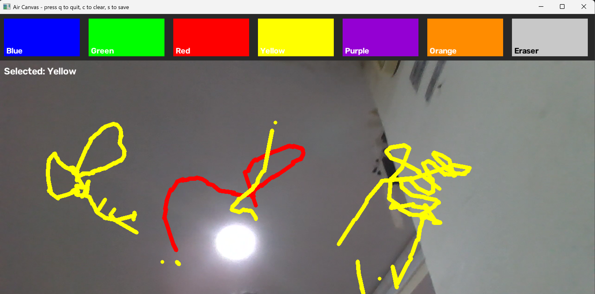

# Air Canvas

Draw in the air using your webcam. Uses a pretrained hand-tracking model
(MediaPipe) to follow your index finger through your webcam and turns its
movement into drawing on screen — no mouse, no touchscreen. Pick colors and
an eraser by holding up two fingers and hovering over an on-screen toolbar.

See [air_canvas/README.md](air_canvas/README.md) for setup and usage
instructions.
